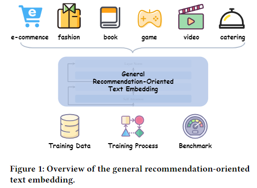
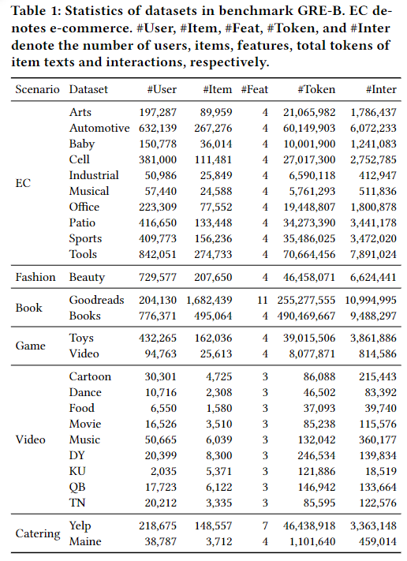

# GRE: General Recommendation-Oriented Text Embedding

## Introduction

Text embedding models have demonstrated immense potential in semantic understanding, which recommendation systems can leverage to discern subtle differences between items, thereby enhancing performance. Although general text embedding models have achieved broad success, there is currently a lack of an embedding model specifically designed for recommendation systems that excels across diverse recommendation scenarios, rather than being exclusively developed for specific downstream tasks or datasets. To bridge these gaps, we introduce the General Recommendation-Oriented Text Embedding (GRE) and a comprehensive benchmark, GRE-B, in this repo. Figure 1 illustrates the overview of our work.

<div align=center> </div>

### GRE

We pre-trained GRE on a wide array of data specifically curated from various recommendation domains covering _e-commerce, catering, fashion, books, games, videos_ and more. To ensure the quality and balance of the data, we employed the Coreset method by selecting high-quality texts to maintain balance across various domains. Then, GRE is further refined by extracting high-quality item pairs through collaborative signals and directly integrating such signals into the model through contrastive learning.

After fine-tuning, you can use the model to generate textual item embeddings for recommendation tasks.

### GRE-B

To comprehensively assess our general recommendation-oriented embedding, we have established a benchmark using diverse recommendation datasets which are distinct from the training data to guarantee fairness in evaluation. Our benchmark includes a total of 26 datasets, which are categorized into six recommendation scenarios: e-commerce, fashion, books, games, video, and catering. The statistics of the datasets can be found in Table 1.

We utilize [SASRec](https://github.com/kang205/SASRec) and _DSSM_ for the **retrieval** task, and the results are evaluated using metrics including NDCG and Recall. As for the **ranking** task, _DIN_ and _DeepFM_ are employed, while AUC and Logloss are chosen for evaluation.

<div align=center></div>

## Usage

### Environment

```bash
conda env create -f deepspeed.yaml
```

## Benchmark

### Ranking

for naive:

```bash
bash ctr.sh [CUDA_ID_0] [CUDA_ID_1] [DATASET_NAME]
```

for text-embedding-enhanced:

```bash
bash ctrwlm.sh [CUDA_ID_0] [CUDA_ID_1] [DATASET_NAME] [TEXT_EMBEDDING_PATH] [SAVE_PREFIX]
```

### Retrieval

for naive:

```bash
cd RecStudio
bash gre.sh SASRec [DATASET_PKL_PATH] [TEXT_EMBEDDING_PATH]
```

for text-embedding-enhanced:

```bash
cd RecStudio
bash gre.sh TE_ID_SASRec [DATASET_PKL_PATH] [TEXT_EMBEDDING_PATH]
```

### Configuration

You can change the configuration in `din.yaml`, `sasrec.yaml` and `te_id_sasrec.yaml` to search the best results.

